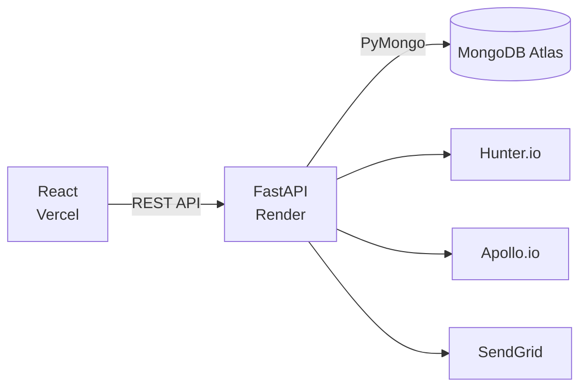

<div align="center">

# LeadGeneration

**A full-stack B2B lead generation platform that discovers contacts, verifies emails, and organizes leads in one dashboard.**

[](https://react.dev)
[](https://fastapi.tiangolo.com)
[](https://www.mongodb.com)
[](https://vitejs.dev)

[Quick Start](#quick-start) • [Features](#features) • [Architecture](#architecture) • [API](#api-reference)

</div>

---

## Overview

LeadGen helps sales and growth teams find professional contacts at any company, confirm those emails are actually deliverable, and manage everything from a single dashboard — without juggling three separate tools.

| | | |
|---|---|---|
| 🔍 **Discover** | Search any company domain and pull live, verified professional contacts. |
| ✅ **Verify** | Every email is checked and scored — valid, invalid, risky, or unknown. |
| 📊 **Manage** | Search, filter, and export leads from a modern real-time dashboard. |

## Features

**Authentication & Security**
- JWT-based signup and login
- Password reset flow via SendGrid

**Lead Discovery**
- Real-time contact search by company domain
- Returns names, titles, and email addresses
- 20+ pre-loaded companies to try out of the box (Airbnb, Stripe, Shopify, Uber, Notion, and more)

**Email Verification**
- Confidence scoring with clear status badges
- Flags risky or invalid addresses before you send

**Dashboard**
- Live stats on lead volume and email quality
- One-click CSV/Excel export for CRM import

## Tech Stack

| Layer | Technology |
|---|---|
| Frontend | React, Vite, Tailwind CSS |
| Backend | Python, FastAPI |
| Database | MongoDB (via PyMongo) |
| Contact Data | Hunter.io, Apollo.io |
| Email | SendGrid |
| Hosting | Vercel (frontend) · Render (backend) · MongoDB Atlas |

## Architecture



## Quick Start

```bash
# 1. Clone the repo
git clone https://github.com/sakshi-harikant/LeadGeneration.git
cd LeadGeneration

# 2. Backend
cd backend
python -m venv venv
venv\Scripts\activate        # Windows
# source venv/bin/activate   # macOS/Linux
pip install -r requirements.txt
uvicorn app.main:app --reload

# 3. Frontend (in a new terminal)
cd frontend
npm install
npm run dev
```

Open **http://localhost:5173** in your browser.

## Environment Setup

**`backend/.env`**
```env
MONGODB_URI=mongodb+srv://...
HUNTER_API_KEY=your_key
APOLLO_API_KEY=your_key
JWT_SECRET_KEY=your_secret
SENDGRID_API_KEY=your_key
```

**`frontend/.env`**
```env
VITE_API_URL=http://localhost:8000
```

## API Reference

| Method | Endpoint | Description |
|---|---|---|
| `POST` | `/api/auth/signup` | Register a new user |
| `POST` | `/api/auth/login` | Log in a user |
| `POST` | `/api/leads/search/domain` | Search for leads by company domain |
| `GET` | `/api/leads/` | Get all leads (paginated) |
| `GET` | `/api/leads/stats` | Dashboard statistics |
| `GET` | `/api/leads/export/csv` | Export leads to CSV |


[](https://github.com/sakshi-harikant)
[](mailto:connect.sakshi16@gmail.com)

---

