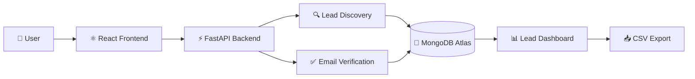
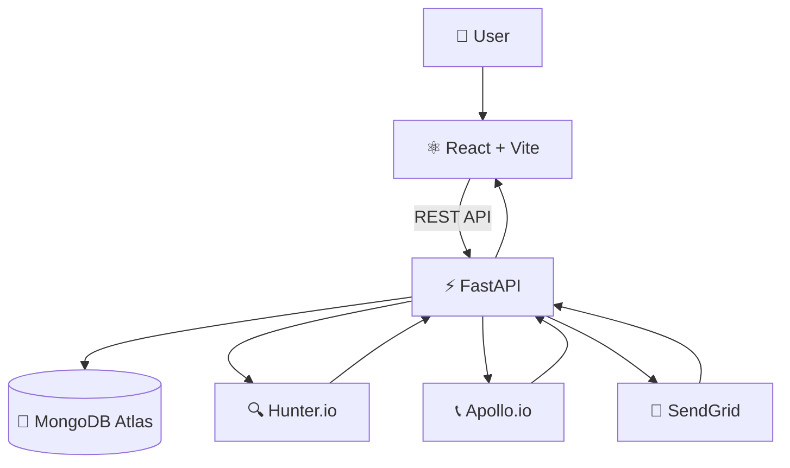

<div align="center">


<br/>


<br/><br/>


<br/><br/>

<p>
  <strong>Full-stack B2B Lead Generation Platform</strong>
  <br/>
  Discover contacts, verify emails, manage leads, and export data from one dashboard.
</p>

<br/>

</div>

---

<div align="center">

## 🚀 LeadGen at a Glance

</div>

<table>
<tr>
<td width="33%" align="center">

### 🔍
**DISCOVER**

Find professional contacts using company and domain information.

</td>

<td width="33%" align="center">

### 🛡️
**VERIFY**

Check email quality and verification status before outreach.

</td>

<td width="33%" align="center">

### 📊
**MANAGE**

Search, filter, organize, and export leads from one dashboard.

</td>
</tr>
</table>

---

## 📌 About the Project

**LeadGen** is a full-stack B2B lead generation application designed to simplify the process of finding and managing professional contacts.

Instead of collecting contact information manually, users can enter company details and keywords, retrieve relevant lead information through external services, verify email data, and manage the results through a centralized dashboard.

### Input

```text
Company Name
Domain Name
Keywords
```

### Output

```text
Name
Job Title
Company
Email
Phone
Profile URL
Email Status
Confidence
```

---

## ⚡ How It Works



### Lead Generation Flow

| Step | Process |
|---|---|
| **01** | User enters company name, domain, and keywords |
| **02** | Frontend sends the request to the FastAPI backend |
| **03** | Backend communicates with lead-data services |
| **04** | Contact information is collected and structured |
| **05** | Email information is verified |
| **06** | Duplicate and invalid records are handled |
| **07** | Lead data is stored in MongoDB |
| **08** | Results are displayed in the dashboard |
| **09** | Users can search, filter, and export leads |

---

## ✨ Core Features

<table>
<tr>

<td width="50%" valign="top">

### 🔐 Authentication

- User registration
- User login
- JWT authentication
- Protected routes
- Password reset workflow

</td>

<td width="50%" valign="top">

### 🔎 Lead Discovery

- Company-based search
- Domain-based search
- Keyword-based search
- Professional contact discovery
- Structured lead information

</td>

</tr>

<tr>

<td width="50%" valign="top">

### ✅ Email Verification

- Email verification
- Verification status
- Confidence information
- Valid / invalid / risky / unknown states

</td>

<td width="50%" valign="top">

### 📊 Lead Dashboard

- View collected leads
- Search leads
- Filter lead information
- Lead statistics
- Organized lead records

</td>

</tr>

<tr>

<td width="50%" valign="top">

### 📥 Export

- CSV export
- Spreadsheet-compatible data
- Easy data transfer
- CRM-ready workflow

</td>

<td width="50%" valign="top">

### 🧹 Data Management

- Duplicate detection
- Input validation
- Structured lead records
- Database persistence

</td>

</tr>
</table>

---

## 🛠️ Technology Stack

<div align="center">

### Frontend


<br/><br/>

### Backend & Database


<br/><br/>

### Development


</div>

### Stack Details

| Layer | Technology |
|---|---|
| **Frontend** | React.js, Vite, Tailwind CSS |
| **Backend** | Python, FastAPI |
| **Database** | MongoDB Atlas |
| **Authentication** | JWT |
| **Lead Data** | Hunter.io / Apollo.io |
| **Email Service** | SendGrid |
| **API Communication** | REST |
| **Version Control** | Git & GitHub |

---

## 🏗️ System Architecture



---

## 📂 Project Structure

```text
LeadGeneration/
│
├── backend/
│   ├── app/
│   │   ├── main.py
│   │   ├── routes/
│   │   ├── models/
│   │   ├── services/
│   │   ├── database/
│   │   └── utils/
│   │
│   ├── requirements.txt
│   └── .env
│
├── frontend/
│   ├── src/
│   │   ├── components/
│   │   ├── pages/
│   │   ├── services/
│   │   ├── hooks/
│   │   └── App.jsx
│   │
│   ├── package.json
│   └── .env
│
├── .gitignore
└── README.md
```

---

## 🚀 Getting Started

### 1. Clone the Repository

```bash
git clone https://github.com/sakshi-harikant/LeadGeneration.git
cd LeadGeneration
```

---

### 2. Backend Setup

Navigate to the backend:

```bash
cd backend
```

Create a virtual environment:

```bash
python -m venv venv
```

Activate it on Windows:

```bash
venv\Scripts\activate
```

Install dependencies:

```bash
pip install -r requirements.txt
```

Start the backend:

```bash
uvicorn app.main:app --reload
```

Backend will run at:

```text
http://localhost:8000
```

FastAPI documentation:

```text
http://localhost:8000/docs
```

---

### 3. Frontend Setup

Open a new terminal:

```bash
cd frontend
```

Install dependencies:

```bash
npm install
```

Start the development server:

```bash
npm run dev
```

Frontend will run at:

```text
http://localhost:5173
```

---

## ⚙️ Environment Configuration

### Backend

Create:

```text
backend/.env
```

Add:

```env
MONGODB_URI=mongodb+srv://...
HUNTER_API_KEY=your_hunter_api_key
APOLLO_API_KEY=your_apollo_api_key
JWT_SECRET_KEY=your_secret_key
SENDGRID_API_KEY=your_sendgrid_api_key
```

### Frontend

Create:

```text
frontend/.env
```

Add:

```env
VITE_API_URL=http://localhost:8000
```

> ⚠️ Never commit `.env` files or API keys to GitHub.

---

## 📡 API Endpoints

### Authentication

| Method | Endpoint | Description |
|---|---|---|
| `POST` | `/api/auth/signup` | Create a new account |
| `POST` | `/api/auth/login` | Authenticate a user |
| `POST` | `/api/auth/forgot-password` | Start password reset |

### Leads

| Method | Endpoint | Description |
|---|---|---|
| `POST` | `/api/leads/search/domain` | Search leads by domain |
| `GET` | `/api/leads/` | Retrieve leads |
| `GET` | `/api/leads/stats` | Retrieve dashboard statistics |
| `GET` | `/api/leads/export/csv` | Export leads as CSV |

---

## 🔎 Lead Search Example

### Input

```text
Company Name: Shopify
Domain Name: shopify.com
Keywords: Engineering Manager
```

### Processing

```text
Shopify
   ↓
shopify.com
   ↓
Lead Discovery
   ↓
Contact Processing
   ↓
Email Verification
   ↓
Duplicate Check
   ↓
MongoDB
```

### Result

```text
┌──────────────────────────────────────────────┐
│ Name              Job Title                 │
│ Email             Company                   │
│ Phone             Verification Status       │
│ Profile URL       Confidence                │
└──────────────────────────────────────────────┘
```

---

## 📊 Dashboard Capabilities

The dashboard provides a centralized workspace for collected leads.

### Users can:

- 🔍 Search leads
- 🎯 Filter results
- 📈 View lead statistics
- ✅ Check email status
- 🏢 View company information
- 📥 Export lead data
- 🧹 Manage duplicate records

---

## 🗄️ Lead Data Structure

A typical lead record contains:

```json
{
  "name": "Example Person",
  "job_title": "Engineering Manager",
  "company": "Example Company",
  "domain": "example.com",
  "email": "person@example.com",
  "phone": "+91XXXXXXXXXX",
  "profile_url": "https://example.com/profile",
  "email_status": "valid",
  "confidence": 92
}
```

---

## 🔒 Security

LeadGen uses several measures to protect application data:

- JWT-based authentication
- Protected API routes
- Environment variables for secrets
- Password reset workflow
- Input validation
- Duplicate lead handling
- Server-side API key protection

API keys are kept on the backend and are not exposed directly to the frontend.

---

## 📥 Export Workflow

```text
Dashboard
    ↓
Select / Filter Leads
    ↓
Export
    ↓
CSV File
    ↓
Spreadsheet / CRM / Analysis
```

---

## 🧪 Development Commands

### Backend

```bash
cd backend
venv\Scripts\activate
uvicorn app.main:app --reload
```

### Frontend

```bash
cd frontend
npm run dev
```

### Production Build

```bash
npm run build
```

---

<div align="center">

## 🔗 LeadGen

**Discover. Verify. Connect.**

<br/>


</div>
