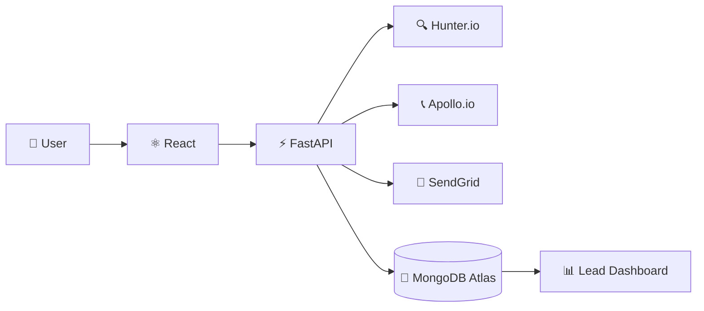

<div align="center">


<br/>


<br/><br/>


<br/><br/>

**A full-stack B2B lead generation platform for discovering, verifying, and managing professional leads.**

</div>

---

## 🎯 What is LeadGen?

LeadGen simplifies the process of finding professional contacts from companies.

Enter a **company, domain, and keywords**, discover relevant contacts, verify their email information, and manage the results from one dashboard.

```text
Company + Domain + Keywords
              ↓
       Lead Discovery
              ↓
      Email Verification
              ↓
        Lead Dashboard
              ↓
         CSV Export
```

---

## ✨ Features

<table>
<tr>

<td width="50%" valign="top">

### 🔍 Lead Discovery

Find professional contacts using:

- Company name
- Domain
- Keywords
- Job titles

</td>

<td width="50%" valign="top">

### ✅ Email Verification

Check discovered email addresses and view their verification status.

</td>

</tr>

<tr>

<td width="50%" valign="top">

### 📊 Lead Dashboard

- Search leads
- Filter results
- View lead information
- Track lead statistics

</td>

<td width="50%" valign="top">

### 📥 Export

Export collected leads as **CSV** for further analysis or CRM use.

</td>

</tr>
</table>

---

## 🛠️ Tech Stack

<div align="center">


<br/><br/>

| Frontend | Backend | Database |
|:---:|:---:|:---:|
| React | Python + FastAPI | MongoDB Atlas |
| Vite | REST API | PyMongo |
| Tailwind CSS | JWT | |

</div>

### 🔗 APIs & Services

**Hunter.io** · **Apollo.io** · **SendGrid**

---

## 🏗️ Architecture



---

## 🚀 Quick Start

### Backend

```bash
cd backend
python -m venv venv
venv\Scripts\activate
pip install -r requirements.txt
uvicorn app.main:app --reload
```

### Frontend

```bash
cd frontend
npm install
npm run dev
```

Open:

```text
http://localhost:5173
```

---

## ⚙️ Environment Variables

### Backend — `backend/.env`

```env
MONGODB_URI=your_mongodb_uri
HUNTER_API_KEY=your_hunter_api_key
APOLLO_API_KEY=your_apollo_api_key
JWT_SECRET_KEY=your_secret_key
SENDGRID_API_KEY=your_sendgrid_api_key
```

### Frontend — `frontend/.env`

```env
VITE_API_URL=http://localhost:8000
```

> 🔒 Keep API keys and database credentials private. Never commit `.env` files.

---

## 📁 Project Structure

```text
LeadGeneration/
│
├── backend/
│   ├── app/
│   │   ├── routes/
│   │   ├── services/
│   │   ├── models/
│   │   └── main.py
│   └── requirements.txt
│
├── frontend/
│   ├── src/
│   │   ├── components/
│   │   ├── pages/
│   │   └── services/
│   └── package.json
│
└── README.md
```

---

<div align="center">

### LeadGen

**Discover. Verify. Connect.**

</div>
