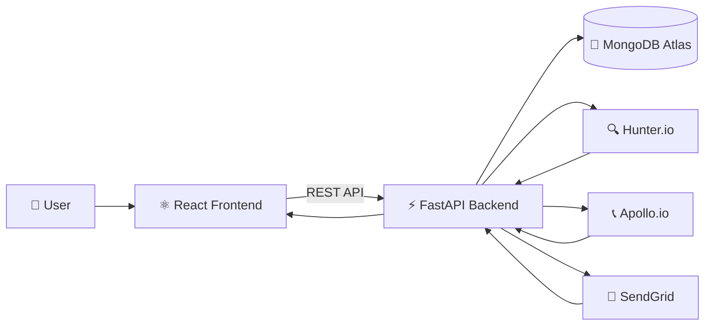

<div align="center">


<br/>


<br/><br/>


<br/><br/>

**A full-stack B2B lead generation platform for discovering, verifying, managing, and exporting professional leads.**

<br/>

</div>

---

## 🎯 Overview

**LeadGen** is a full-stack B2B lead generation application that helps users discover professional contacts associated with companies and manage them from a centralized dashboard.

The application combines external lead-data services with email verification, authentication, database storage, filtering, and export functionality.

### Core workflow

```text
Company / Domain / Keywords
            ↓
     Lead Discovery
            ↓
    Contact Processing
            ↓
     Email Verification
            ↓
       MongoDB
            ↓
    Lead Dashboard
            ↓
      CSV / Excel
```

---

## ✨ Features

<table>
<tr>
<td width="50%" valign="top">

### 🔐 Authentication

* User signup and login
* JWT-based authentication
* Secure password handling
* Password reset functionality
* Protected application routes

</td>

<td width="50%" valign="top">

### 🔍 Lead Discovery

* Search leads by company domain
* Retrieve professional contact information
* Contact names and job titles
* Company information
* Email discovery

</td>
</tr>

<tr>
<td width="50%" valign="top">

### ✅ Email Verification

* Email verification
* Verification status
* Confidence information
* Valid / invalid / risky / unknown states

</td>

<td width="50%" valign="top">

### 📊 Lead Management

* Centralized lead dashboard
* Search and filtering
* Lead statistics
* Duplicate handling
* Data validation

</td>
</tr>

<tr>
<td width="50%" valign="top">

### 📥 Data Export

* Export lead data
* CSV support
* Excel-compatible data
* Easy CRM/data analysis workflow

</td>

<td width="50%" valign="top">

### 🏢 Company Search

* Search using company/domain information
* Keyword-based lead discovery
* Pre-loaded company examples
* Structured lead results

</td>
</tr>
</table>

---

## 🛠️ Tech Stack

### Frontend

<p>

</p>

* React.js
* Vite
* JavaScript
* Tailwind CSS

### Backend

<p>

</p>

* Python
* FastAPI
* REST APIs
* JWT Authentication

### Database

<p>

</p>

* MongoDB
* MongoDB Atlas
* PyMongo

### External Services

* Hunter.io — lead discovery and email-related data
* Apollo.io — contact/company data where configured
* SendGrid — email delivery for authentication workflows

### Development Tools

<p>

</p>

* Git
* GitHub
* VS Code

---

## 🏗️ System Architecture



---

## 🔄 Lead Generation Flow

```text
1. User logs in
        ↓
2. User enters:
   • Company Name
   • Domain Name
   • Keywords
        ↓
3. Backend validates the request
        ↓
4. Lead discovery service is called
        ↓
5. Contact information is collected
        ↓
6. Email information is verified
        ↓
7. Duplicate leads are filtered
        ↓
8. Leads are stored in MongoDB
        ↓
9. Dashboard displays the results
        ↓
10. User can search, filter and export
```

---

## 📁 Project Structure

```text
LeadGeneration/
│
├── backend/
│   ├── app/
│   │   ├── main.py
│   │   ├── routes/
│   │   ├── models/
│   │   ├── services/
│   │   ├── database/
│   │   └── utils/
│   │
│   ├── requirements.txt
│   └── .env
│
├── frontend/
│   ├── src/
│   │   ├── components/
│   │   ├── pages/
│   │   ├── services/
│   │   └── App.jsx
│   │
│   ├── package.json
│   └── .env
│
├── .gitignore
└── README.md
```

---

## ⚙️ Environment Variables

### Backend

Create:

```text
backend/.env
```

```env
MONGODB_URI=mongodb+srv://...
HUNTER_API_KEY=your_hunter_api_key
APOLLO_API_KEY=your_apollo_api_key
JWT_SECRET_KEY=your_secret_key
SENDGRID_API_KEY=your_sendgrid_api_key
```

### Frontend

Create:

```text
frontend/.env
```

```env
VITE_API_URL=http://localhost:8000
```

> Never commit API keys, passwords, JWT secrets, or MongoDB credentials to GitHub.

---

## 🚀 Getting Started

### 1. Clone the repository

```bash
git clone https://github.com/sakshi-harikant/LeadGeneration.git
cd LeadGeneration
```

### 2. Set up the backend

```bash
cd backend
python -m venv venv
```

Activate the virtual environment on Windows:

```bash
venv\Scripts\activate
```

Install dependencies:

```bash
pip install -r requirements.txt
```

Start the API:

```bash
uvicorn app.main:app --reload
```

Backend:

```text
http://localhost:8000
```

API documentation:

```text
http://localhost:8000/docs
```

### 3. Set up the frontend

Open a new terminal:

```bash
cd frontend
npm install
npm run dev
```

Frontend:

```text
http://localhost:5173
```

---

## 📡 API Endpoints

| Method | Endpoint                    | Purpose                       |
| ------ | --------------------------- | ----------------------------- |
| `POST` | `/api/auth/signup`          | Create a new account          |
| `POST` | `/api/auth/login`           | Authenticate a user           |
| `POST` | `/api/auth/forgot-password` | Start password reset          |
| `POST` | `/api/leads/search/domain`  | Search leads by domain        |
| `GET`  | `/api/leads/`               | Retrieve leads                |
| `GET`  | `/api/leads/stats`          | Retrieve dashboard statistics |
| `GET`  | `/api/leads/export/csv`     | Export leads as CSV           |

---

## 🗄️ Data Model

A lead can contain information such as:

```text
Lead
├── Name
├── Job Title
├── Company
├── Domain
├── Email
├── Phone
├── LinkedIn / Profile URL
├── Email Status
├── Confidence
└── Created At
```

User accounts contain authentication-related information required for accessing the application.

---

## 🔎 Lead Search

The application accepts three primary inputs:

```text
Company Name
Domain Name
Keywords
```

Example:

```text
Company: Shopify
Domain: shopify.com
Keywords: Engineering Manager
```

The backend processes the request and returns structured lead information that can be reviewed from the dashboard.

---

## 📊 Dashboard

The dashboard provides a centralized view of collected leads.

Users can:

* View discovered leads
* Search leads
* Filter lead information
* Check email status
* Review lead statistics
* Export collected data

---

## 📥 Export

Lead information can be exported for further processing or use with external CRM and spreadsheet workflows.

Supported format:

```text
CSV
```

Excel-compatible data can be opened directly using spreadsheet applications.

---

## 🔒 Security

The application includes:

* JWT-based authentication
* Protected API routes
* Environment-based secret management
* Password reset workflow
* Input validation
* Duplicate lead handling

API credentials are stored using environment variables rather than being hard-coded into the source code.

---

## 🧪 Local Development

Run the backend:

```bash
cd backend
venv\Scripts\activate
uvicorn app.main:app --reload
```

Run the frontend in another terminal:

```bash
cd frontend
npm run dev
```

Then open:

```text
http://localhost:5173
```

---

## 🗺️ Future Improvements

Potential future improvements include:

* Advanced lead filtering
* More export formats
* Additional CRM integrations
* Improved duplicate detection
* Background lead-processing jobs
* More detailed analytics
* Additional data providers
* Role-based access control

---

## 👩‍💻 Author

<div align="center">


### Sakshi Mohan Harikant

<a href="https://github.com/sakshi-harikant">

</a>

</div>

---

<div align="center">

### LeadGen

**Discover. Verify. Connect.**


</div>
