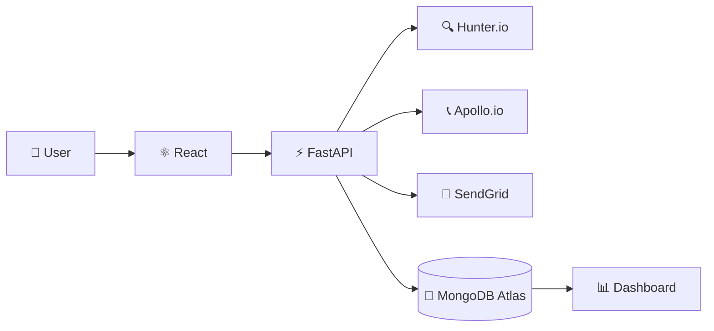

<div align="center">


<br/>


<br/><br/>

<p align="center">
<strong>LeadGen</strong> is a full-stack B2B lead generation platform that helps users discover professional contacts, verify email information, and manage leads through a centralized dashboard.
</p>

</div>

---

## 🎯 What is LeadGen?

LeadGen simplifies the process of finding professional contacts from companies.

Users can enter a **company name, domain, and keywords** to discover relevant leads, verify their email information, and manage the results from one place.

```text
Company + Domain + Keywords
            ↓
      Lead Discovery
            ↓
     Email Verification
            ↓
       Lead Dashboard
            ↓
        CSV Export
```

---

## ✨ Key Features

| 🔍 Lead Discovery | ✅ Email Verification |
|---|---|
| Find professional contacts using company, domain, and keywords. | Check email addresses and their verification status. |

| 📊 Lead Dashboard | 📥 Export |
|---|---|
| Search, filter, and manage collected leads. | Export lead data as CSV. |

---

## 🛠️ Tech Stack

<div align="center">


</div>

| Layer | Technology |
|---|---|
| **Frontend** | React, Vite, Tailwind CSS |
| **Backend** | Python, FastAPI |
| **Database** | MongoDB Atlas |
| **Authentication** | JWT |
| **Lead Services** | Hunter.io, Apollo.io |
| **Email Service** | SendGrid |
| **API** | REST |

---

## 🏗️ Architecture



---

## 🚀 Quick Start

### Backend

```bash
cd backend
python -m venv venv
venv\Scripts\activate
pip install -r requirements.txt
uvicorn app.main:app --reload
```

### Frontend

```bash
cd frontend
npm install
npm run dev
```

Open:

```text
http://localhost:5173
```

---

## ⚙️ Environment Variables

### `backend/.env`

```env
MONGODB_URI=your_mongodb_uri
HUNTER_API_KEY=your_hunter_api_key
APOLLO_API_KEY=your_apollo_api_key
JWT_SECRET_KEY=your_secret_key
SENDGRID_API_KEY=your_sendgrid_api_key
```

### `frontend/.env`

```env
VITE_API_URL=http://localhost:8000
```

> 🔒 Keep API keys and database credentials private. Never commit `.env` files.

---

## 📁 Project Structure

```text
LeadGeneration/
│
├── backend/
│   ├── app/
│   │   ├── routes/
│   │   ├── services/
│   │   ├── models/
│   │   └── main.py
│   └── requirements.txt
│
├── frontend/
│   ├── src/
│   │   ├── components/
│   │   ├── pages/
│   │   └── services/
│   └── package.json
│
└── README.md
```

---

<div align="center">

### LeadGen

**Discover. Verify. Connect.**

</div>
